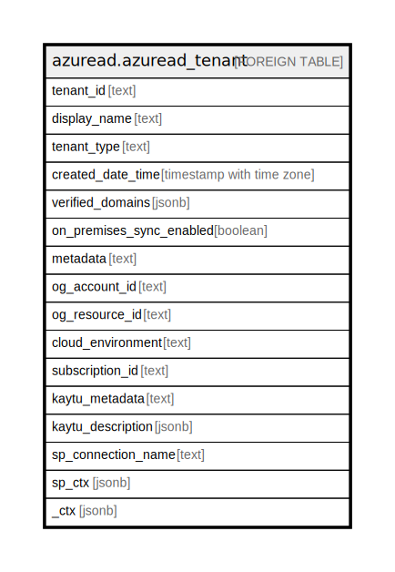

# azuread.azuread_tenant

## Description

Represents an Azure AD Tenant.

## Columns

| Name | Type | Default | Nullable | Children | Parents | Comment |
| ---- | ---- | ------- | -------- | -------- | ------- | ------- |
| tenant_id | text |  | true |  |  | The unique identifier for the Tenant. |
| display_name | text |  | true |  |  | The name displayed in the address book for the Tenant. |
| tenant_type | text |  | true |  |  | The type of the Tenant. |
| created_date_time | timestamp with time zone |  | true |  |  | The creation time for the Tenant. |
| verified_domains | jsonb |  | true |  |  | Tenant verified domains. |
| on_premises_sync_enabled | boolean |  | true |  |  | Tenant verified domains. |
| metadata | text |  | true |  |  | Metadata of the Azure resource |
| og_account_id | text |  | true |  |  | The Platform Account ID in which the resource is located. |
| og_resource_id | text |  | true |  |  | The unique ID of the resource in opengovernance. |
| cloud_environment | text |  | true |  |  |  |
| subscription_id | text |  | true |  |  |  |
| kaytu_metadata | text |  | true |  |  |  |
| kaytu_description | jsonb |  | true |  |  | The full model description of the resource |
| sp_connection_name | text |  | true |  |  | Steampipe connection name. |
| sp_ctx | jsonb |  | true |  |  | Steampipe context in JSON form. |
| _ctx | jsonb |  | true |  |  | Steampipe context in JSON form. |

## Relations

---

> Generated by [tbls](https://github.com/k1LoW/tbls)
