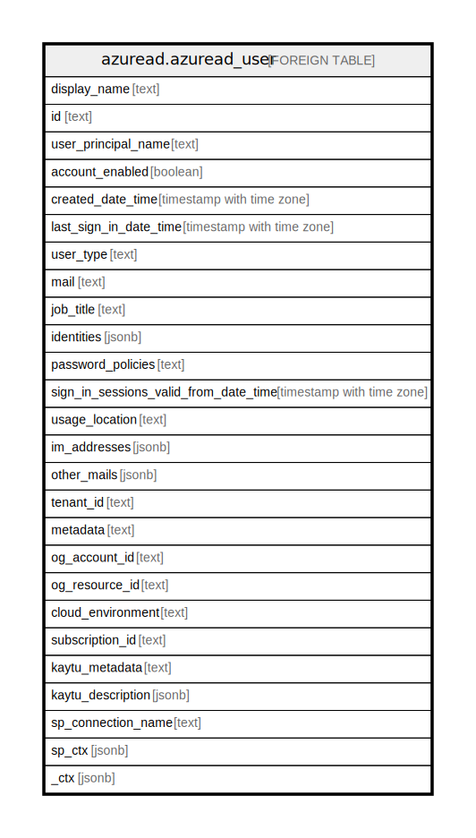

# azuread.azuread_user

## Description

Represents an Azure AD user account.

## Columns

| Name | Type | Default | Nullable | Children | Parents | Comment |
| ---- | ---- | ------- | -------- | -------- | ------- | ------- |
| display_name | text |  | true |  |  | The name displayed in the address book for the user. This is usually the combination of the user's first name, middle initial and last name. |
| id | text |  | true |  |  | The unique identifier for the user. Should be treated as an opaque identifier. |
| user_principal_name | text |  | true |  |  | Principal email of the active directory user. |
| account_enabled | boolean |  | true |  |  | True if the account is enabled; otherwise, false. |
| created_date_time | timestamp with time zone |  | true |  |  | The time at which the user was created. |
| last_sign_in_date_time | timestamp with time zone |  | true |  |  | The time at which the user was last signed in. |
| user_type | text |  | true |  |  | A string value that can be used to classify user types in your directory. |
| mail | text |  | true |  |  | The SMTP address for the user, for example, jeff@contoso.onmicrosoft.com. |
| job_title | text |  | true |  |  | The user job title. |
| identities | jsonb |  | true |  |  | User identities |
| password_policies | text |  | true |  |  | Specifies password policies for the user. This value is an enumeration with one possible value being DisableStrongPassword, which allows weaker passwords than the default policy to be specified. DisablePasswordExpiration can also be specified. The two may be specified together; for example: DisablePasswordExpiration, DisableStrongPassword. |
| sign_in_sessions_valid_from_date_time | timestamp with time zone |  | true |  |  | Any refresh tokens or sessions tokens (session cookies) issued before this time are invalid, and applications will get an error when using an invalid refresh or sessions token to acquire a delegated access token (to access APIs such as Microsoft Graph). |
| usage_location | text |  | true |  |  | A two letter country code (ISO standard 3166), required for users that will be assigned licenses due to legal requirement to check for availability of services in countries. |
| im_addresses | jsonb |  | true |  |  | The instant message voice over IP (VOIP) session initiation protocol (SIP) addresses for the user. |
| other_mails | jsonb |  | true |  |  | A list of additional email addresses for the user. |
| tenant_id | text |  | true |  |  | The Azure Tenant ID where the resource is located. |
| metadata | text |  | true |  |  | Metadata of the Azure resource |
| og_account_id | text |  | true |  |  | The Platform Account ID in which the resource is located. |
| og_resource_id | text |  | true |  |  | The unique ID of the resource in opengovernance. |
| cloud_environment | text |  | true |  |  |  |
| subscription_id | text |  | true |  |  |  |
| kaytu_metadata | text |  | true |  |  |  |
| kaytu_description | jsonb |  | true |  |  | The full model description of the resource |
| sp_connection_name | text |  | true |  |  | Steampipe connection name. |
| sp_ctx | jsonb |  | true |  |  | Steampipe context in JSON form. |
| _ctx | jsonb |  | true |  |  | Steampipe context in JSON form. |

## Relations

---

> Generated by [tbls](https://github.com/k1LoW/tbls)
