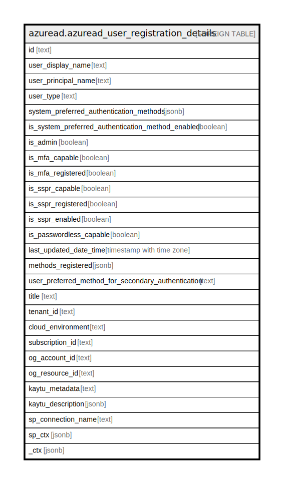

# azuread.azuread_user_registration_details

## Description

Represents an Azure AD user registration details.

## Columns

| Name | Type | Default | Nullable | Children | Parents | Comment |
| ---- | ---- | ------- | -------- | -------- | ------- | ------- |
| id | text |  | true |  |  | The unique identifier for the user. Should be treated as an opaque identifier. |
| user_display_name | text |  | true |  |  | User Display name. |
| user_principal_name | text |  | true |  |  | User Principal name. |
| user_type | text |  | true |  |  | User Type. |
| system_preferred_authentication_methods | jsonb |  | true |  |  | SystemPreferredAuthenticationMethods |
| is_system_preferred_authentication_method_enabled | boolean |  | true |  |  | IsSystemPreferredAuthenticationMethodEnabled |
| is_admin | boolean |  | true |  |  | Whether the user is admin or not. |
| is_mfa_capable | boolean |  | true |  |  | IsMfaCapable |
| is_mfa_registered | boolean |  | true |  |  | IsMfaRegistered |
| is_sspr_capable | boolean |  | true |  |  | IsSsprCapable |
| is_sspr_registered | boolean |  | true |  |  | IsSsprRegistered |
| is_sspr_enabled | boolean |  | true |  |  | IsSsprEnabled |
| is_passwordless_capable | boolean |  | true |  |  | IsPasswordlessCapable |
| last_updated_date_time | timestamp with time zone |  | true |  |  | LastUpdatedDateTime |
| methods_registered | jsonb |  | true |  |  | MethodsRegistered |
| user_preferred_method_for_secondary_authentication | text |  | true |  |  | UserPreferredMethodForSecondaryAuthentication |
| title | text |  | true |  |  | Title of the resource. |
| tenant_id | text |  | true |  |  | The Azure Tenant ID where the resource is located. |
| cloud_environment | text |  | true |  |  |  |
| subscription_id | text |  | true |  |  |  |
| og_account_id | text |  | true |  |  | The Platform Account ID in which the resource is located. |
| og_resource_id | text |  | true |  |  | The unique ID of the resource in opengovernance. |
| kaytu_metadata | text |  | true |  |  |  |
| kaytu_description | jsonb |  | true |  |  | The full model description of the resource |
| sp_connection_name | text |  | true |  |  | Steampipe connection name. |
| sp_ctx | jsonb |  | true |  |  | Steampipe context in JSON form. |
| _ctx | jsonb |  | true |  |  | Steampipe context in JSON form. |

## Relations

---

> Generated by [tbls](https://github.com/k1LoW/tbls)
