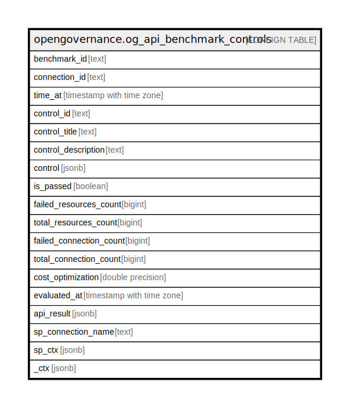

# opengovernance.og_api_benchmark_controls

## Description

Wrapper for benchmark summary api

## Columns

| Name | Type | Default | Nullable | Children | Parents | Comment |
| ---- | ---- | ------- | -------- | -------- | ------- | ------- |
| benchmark_id | text |  | true |  |  | The ID of the benchmark in the platform |
| connection_id | text |  | true |  |  | The connection IDs included in the benchmark controls |
| time_at | timestamp with time zone |  | true |  |  | The timestamp of the benchmark controls record |
| control_id | text |  | true |  |  | Control id |
| control_title | text |  | true |  |  | Control title |
| control_description | text |  | true |  |  | Control description |
| control | jsonb |  | true |  |  | The control object |
| is_passed | boolean |  | true |  |  | The status of the control |
| failed_resources_count | bigint |  | true |  |  | The count of failed resources |
| total_resources_count | bigint |  | true |  |  | The total count of resources |
| failed_connection_count | bigint |  | true |  |  | The count of failed connections |
| total_connection_count | bigint |  | true |  |  | The total count of connections |
| cost_optimization | double precision |  | true |  |  | The cost optimization |
| evaluated_at | timestamp with time zone |  | true |  |  | The timestamp of the evaluation |
| api_result | jsonb |  | true |  |  | The result of the benchmark control summary |
| sp_connection_name | text |  | true |  |  | Steampipe connection name. |
| sp_ctx | jsonb |  | true |  |  | Steampipe context in JSON form. |
| _ctx | jsonb |  | true |  |  | Steampipe context in JSON form. |

## Relations

---

> Generated by [tbls](https://github.com/k1LoW/tbls)
