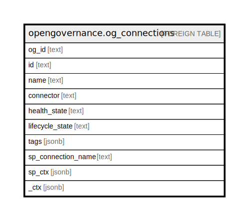

# opengovernance.og_connections

## Description

OpenGovernance Connections

## Columns

| Name | Type | Default | Nullable | Children | Parents | Comment |
| ---- | ---- | ------- | -------- | -------- | ------- | ------- |
| og_id | text |  | true |  |  | The ID of the connection in OpenGovernance |
| id | text |  | true |  |  | The ID of the connection in the original connector |
| name | text |  | true |  |  | The name of the connection |
| connector | text |  | true |  |  |  |
| health_state | text |  | true |  |  |  |
| lifecycle_state | text |  | true |  |  |  |
| tags | jsonb |  | true |  |  |  |
| sp_connection_name | text |  | true |  |  | Steampipe connection name. |
| sp_ctx | jsonb |  | true |  |  | Steampipe context in JSON form. |
| _ctx | jsonb |  | true |  |  | Steampipe context in JSON form. |

## Relations

---

> Generated by [tbls](https://github.com/k1LoW/tbls)
