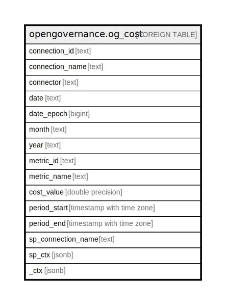

# opengovernance.og_cost

## Description

Account-level cost of connections onboarded into platform

## Columns

| Name | Type | Default | Nullable | Children | Parents | Comment |
| ---- | ---- | ------- | -------- | -------- | ------- | ------- |
| connection_id | text |  | true |  |  |  |
| connection_name | text |  | true |  |  |  |
| connector | text |  | true |  |  |  |
| date | text |  | true |  |  |  |
| date_epoch | bigint |  | true |  |  |  |
| month | text |  | true |  |  |  |
| year | text |  | true |  |  |  |
| metric_id | text |  | true |  |  |  |
| metric_name | text |  | true |  |  |  |
| cost_value | double precision |  | true |  |  |  |
| period_start | timestamp with time zone |  | true |  |  |  |
| period_end | timestamp with time zone |  | true |  |  |  |
| sp_connection_name | text |  | true |  |  | Steampipe connection name. |
| sp_ctx | jsonb |  | true |  |  | Steampipe context in JSON form. |
| _ctx | jsonb |  | true |  |  | Steampipe context in JSON form. |

## Relations

---

> Generated by [tbls](https://github.com/k1LoW/tbls)
