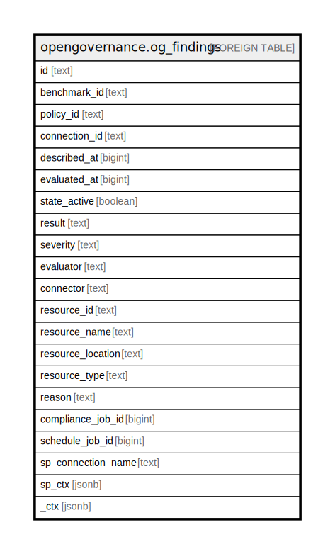

# opengovernance.og_findings

## Description

OpenGovernance Compliance Findings

## Columns

| Name | Type | Default | Nullable | Children | Parents | Comment |
| ---- | ---- | ------- | -------- | -------- | ------- | ------- |
| id | text |  | true |  |  |  |
| benchmark_id | text |  | true |  |  |  |
| policy_id | text |  | true |  |  |  |
| connection_id | text |  | true |  |  |  |
| described_at | bigint |  | true |  |  |  |
| evaluated_at | bigint |  | true |  |  |  |
| state_active | boolean |  | true |  |  |  |
| result | text |  | true |  |  |  |
| severity | text |  | true |  |  |  |
| evaluator | text |  | true |  |  |  |
| connector | text |  | true |  |  |  |
| resource_id | text |  | true |  |  |  |
| resource_name | text |  | true |  |  |  |
| resource_location | text |  | true |  |  |  |
| resource_type | text |  | true |  |  |  |
| reason | text |  | true |  |  |  |
| compliance_job_id | bigint |  | true |  |  |  |
| schedule_job_id | bigint |  | true |  |  |  |
| sp_connection_name | text |  | true |  |  | Steampipe connection name. |
| sp_ctx | jsonb |  | true |  |  | Steampipe context in JSON form. |
| _ctx | jsonb |  | true |  |  | Steampipe context in JSON form. |

## Relations

---

> Generated by [tbls](https://github.com/k1LoW/tbls)
