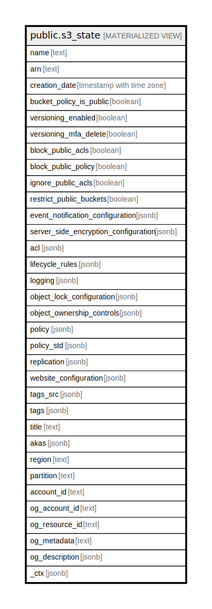

# public.s3_state

## Description

<details>
<summary><strong>Table Definition</strong></summary>

```sql
CREATE MATERIALIZED VIEW s3_state AS (
 SELECT b.name,
    b.arn,
    b.creation_date,
    b.bucket_policy_is_public,
    b.versioning_enabled,
    b.versioning_mfa_delete,
    b.block_public_acls,
    b.block_public_policy,
    b.ignore_public_acls,
    b.restrict_public_buckets,
    b.event_notification_configuration,
    b.server_side_encryption_configuration,
    b.acl,
    b.lifecycle_rules,
    b.logging,
    b.object_lock_configuration,
    b.object_ownership_controls,
    b.policy,
    b.policy_std,
    b.replication,
    b.website_configuration,
    b.tags_src,
    b.tags,
    b.title,
    b.akas,
    b.region,
    b.partition,
    b.account_id,
    b.og_account_id,
    b.og_resource_id,
    b.og_metadata,
    b.og_description,
    b._ctx
   FROM (aws_s3_bucket b
     JOIN aws_account a ON ((b.account_id = a.account_id)))
  WHERE (((b.name ~~* '%tfstate%'::text) OR (b.name ~~* '%trail%'::text) OR (b.name ~~* '%templates%'::text)) AND ((a.name ~~* '%HealthDataManager%'::text) OR (a.name ~~* '%hdm%'::text) OR (a.name ~~* '%ADorigi%'::text)))
)
```

</details>

## Columns

| Name | Type | Default | Nullable | Children | Parents | Comment |
| ---- | ---- | ------- | -------- | -------- | ------- | ------- |
| name | text |  | true |  |  |  |
| arn | text |  | true |  |  |  |
| creation_date | timestamp with time zone |  | true |  |  |  |
| bucket_policy_is_public | boolean |  | true |  |  |  |
| versioning_enabled | boolean |  | true |  |  |  |
| versioning_mfa_delete | boolean |  | true |  |  |  |
| block_public_acls | boolean |  | true |  |  |  |
| block_public_policy | boolean |  | true |  |  |  |
| ignore_public_acls | boolean |  | true |  |  |  |
| restrict_public_buckets | boolean |  | true |  |  |  |
| event_notification_configuration | jsonb |  | true |  |  |  |
| server_side_encryption_configuration | jsonb |  | true |  |  |  |
| acl | jsonb |  | true |  |  |  |
| lifecycle_rules | jsonb |  | true |  |  |  |
| logging | jsonb |  | true |  |  |  |
| object_lock_configuration | jsonb |  | true |  |  |  |
| object_ownership_controls | jsonb |  | true |  |  |  |
| policy | jsonb |  | true |  |  |  |
| policy_std | jsonb |  | true |  |  |  |
| replication | jsonb |  | true |  |  |  |
| website_configuration | jsonb |  | true |  |  |  |
| tags_src | jsonb |  | true |  |  |  |
| tags | jsonb |  | true |  |  |  |
| title | text |  | true |  |  |  |
| akas | jsonb |  | true |  |  |  |
| region | text |  | true |  |  |  |
| partition | text |  | true |  |  |  |
| account_id | text |  | true |  |  |  |
| og_account_id | text |  | true |  |  |  |
| og_resource_id | text |  | true |  |  |  |
| og_metadata | text |  | true |  |  |  |
| og_description | jsonb |  | true |  |  |  |
| _ctx | jsonb |  | true |  |  |  |

## Referenced Tables

| Name | Columns | Comment | Type |
| ---- | ------- | ------- | ---- |
| [aws_s3_bucket](aws_s3_bucket.md) | 0 |  |  |
| [aws_account](aws_account.md) | 0 |  |  |

## Relations



---

> Generated by [tbls](https://github.com/k1LoW/tbls)
