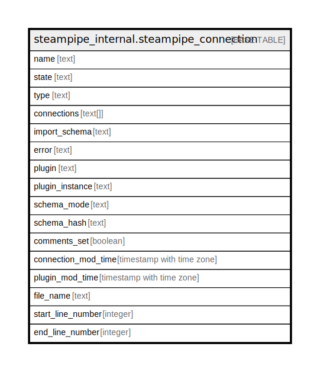

# steampipe_internal.steampipe_connection

## Description

## Columns

| Name | Type | Default | Nullable | Children | Parents | Comment |
| ---- | ---- | ------- | -------- | -------- | ------- | ------- |
| name | text |  | false |  |  |  |
| state | text |  | true |  |  |  |
| type | text |  | true |  |  |  |
| connections | text[] |  | true |  |  |  |
| import_schema | text |  | true |  |  |  |
| error | text |  | true |  |  |  |
| plugin | text |  | true |  |  |  |
| plugin_instance | text |  | true |  |  |  |
| schema_mode | text |  | true |  |  |  |
| schema_hash | text |  | true |  |  |  |
| comments_set | boolean | false | true |  |  |  |
| connection_mod_time | timestamp with time zone |  | true |  |  |  |
| plugin_mod_time | timestamp with time zone |  | true |  |  |  |
| file_name | text |  | true |  |  |  |
| start_line_number | integer |  | true |  |  |  |
| end_line_number | integer |  | true |  |  |  |

## Constraints

| Name | Type | Definition |
| ---- | ---- | ---------- |
| steampipe_connection_pkey | PRIMARY KEY | PRIMARY KEY (name) |

## Indexes

| Name | Definition |
| ---- | ---------- |
| steampipe_connection_pkey | CREATE UNIQUE INDEX steampipe_connection_pkey ON steampipe_internal.steampipe_connection USING btree (name) |

## Relations

---

> Generated by [tbls](https://github.com/k1LoW/tbls)
