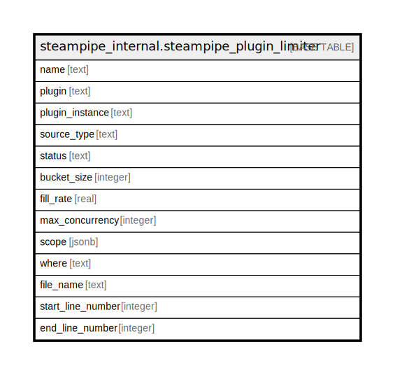

# steampipe_internal.steampipe_plugin_limiter

## Description

## Columns

| Name | Type | Default | Nullable | Children | Parents | Comment |
| ---- | ---- | ------- | -------- | -------- | ------- | ------- |
| name | text |  | true |  |  |  |
| plugin | text |  | true |  |  |  |
| plugin_instance | text |  | true |  |  |  |
| source_type | text |  | true |  |  |  |
| status | text |  | true |  |  |  |
| bucket_size | integer |  | true |  |  |  |
| fill_rate | real |  | true |  |  |  |
| max_concurrency | integer |  | true |  |  |  |
| scope | jsonb |  | true |  |  |  |
| where | text |  | true |  |  |  |
| file_name | text |  | true |  |  |  |
| start_line_number | integer |  | true |  |  |  |
| end_line_number | integer |  | true |  |  |  |

## Relations

---

> Generated by [tbls](https://github.com/k1LoW/tbls)
