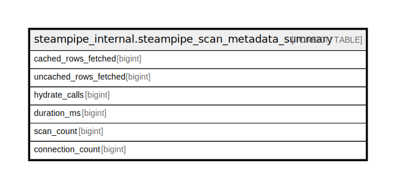

# steampipe_internal.steampipe_scan_metadata_summary

## Description

## Columns

| Name | Type | Default | Nullable | Children | Parents | Comment |
| ---- | ---- | ------- | -------- | -------- | ------- | ------- |
| cached_rows_fetched | bigint |  | true |  |  |  |
| uncached_rows_fetched | bigint |  | true |  |  |  |
| hydrate_calls | bigint |  | true |  |  |  |
| duration_ms | bigint |  | true |  |  |  |
| scan_count | bigint |  | true |  |  |  |
| connection_count | bigint |  | true |  |  |  |

## Relations

---

> Generated by [tbls](https://github.com/k1LoW/tbls)
