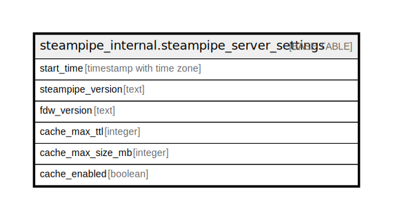

# steampipe_internal.steampipe_server_settings

## Description

## Columns

| Name | Type | Default | Nullable | Children | Parents | Comment |
| ---- | ---- | ------- | -------- | -------- | ------- | ------- |
| start_time | timestamp with time zone |  | false |  |  |  |
| steampipe_version | text |  | false |  |  |  |
| fdw_version | text |  | false |  |  |  |
| cache_max_ttl | integer |  | false |  |  |  |
| cache_max_size_mb | integer |  | false |  |  |  |
| cache_enabled | boolean |  | false |  |  |  |

## Relations

---

> Generated by [tbls](https://github.com/k1LoW/tbls)
